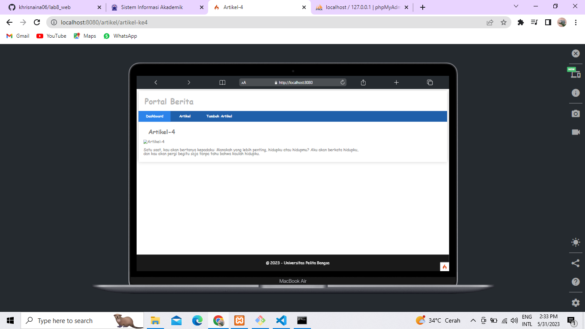

# lab8_web
# Framework lanjutan(CRUD)
---
Berikut ini adalah output dari Pembuatan Aplikasi CRUD Sederhana Dengan MySQL .

## Output
---

- **Database PhpMyAdmin**

- **Tampilan laman LOGIN**

- **Tampilan ketika mendeteksi bukan email yang ditulis pada kolom EMAIL**

- **Tampilan ketika EMAIL tidak terdaftar**

- **Tampilan ketika password SALAH**

- **Tampilan panulisan EMAIL dan PASSWORD**

- **Tampilan setelah LOGIN BERHASIL dan Masuk ke laman ADMIN PORTAL BERITA**

- **Laman TAMBAH ARTIKEL**

- **Laman ARTIKEL**

- **Laman ABOUT**

- **Laman Artikel Detail**

# TERIMA KASIH 
